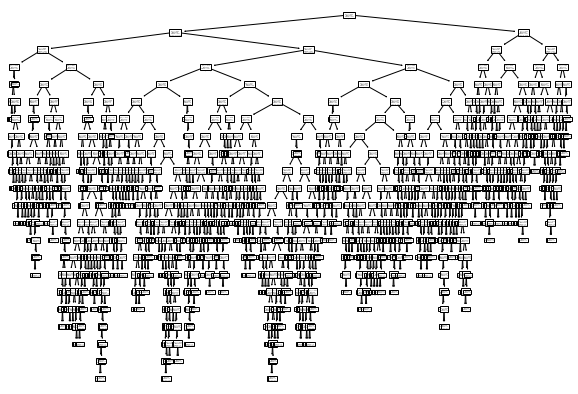
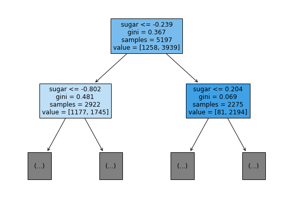
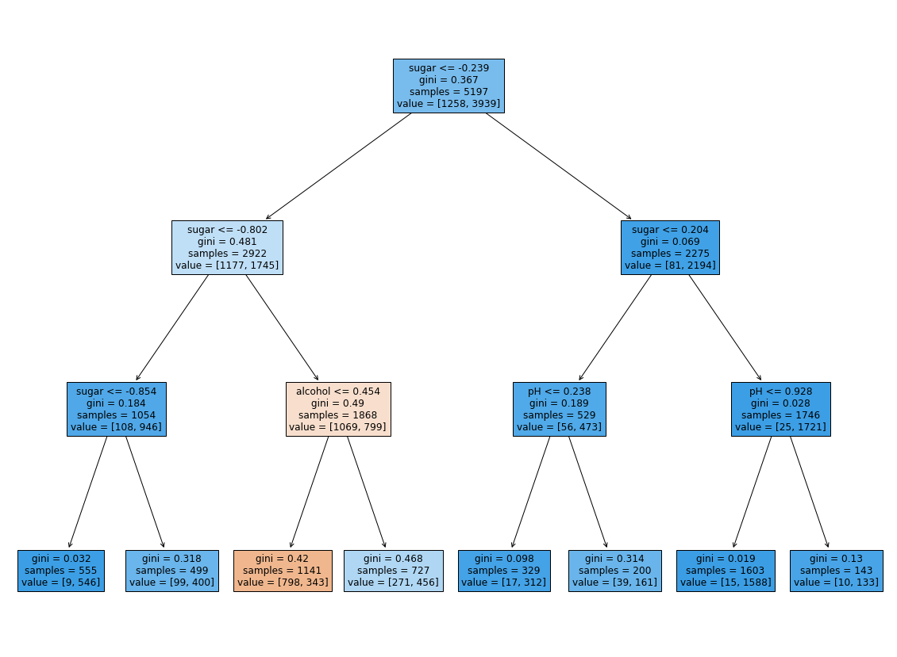
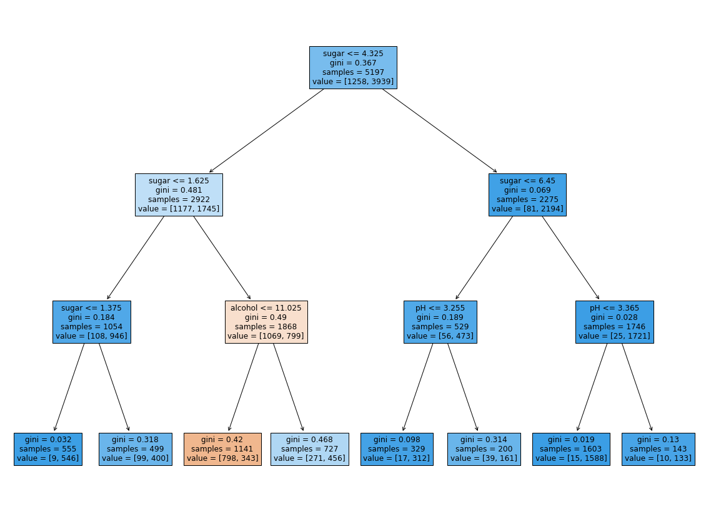

# 1. 결정 트리

---

> 핵심 키워드 - 결정트리, 불순도, 정보 이득, 가지치기, 특성 중요도

---

## 1.1. 레드 와인 & 화이트 와인 분류

    1. 요구사항 - 캔에 인쇄된 알코올 도수, 당도, pH 값으로 와인 종류 구분
    2. 환경 - 품질 확인용으로 수천개의 데이터
    3. 데이터 - https://bit.ly/wine_csv_data (출처: 캐글의 Red Wine Quality 데이터셋 일부 발췌)

```python
import pandas as pd
wine = pd.read_csv('https://bit.ly/wine_csv_data')
```

```python
# 샘플 확인
wine.head()
```

<div>
<style scoped>
    .dataframe tbody tr th:only-of-type {
        vertical-align: middle;
    }

    .dataframe tbody tr th {
        vertical-align: top;
    }

    .dataframe thead th {
        text-align: right;
    }

</style>
<table border="1" class="dataframe">
  <thead>
    <tr style="text-align: right;">
      <th></th>
      <th>alcohol</th>
      <th>sugar</th>
      <th>pH</th>
      <th>class</th>
    </tr>
  </thead>
  <tbody>
    <tr>
      <th>0</th>
      <td>9.4</td>
      <td>1.9</td>
      <td>3.51</td>
      <td>0.0</td>
    </tr>
    <tr>
      <th>1</th>
      <td>9.8</td>
      <td>2.6</td>
      <td>3.20</td>
      <td>0.0</td>
    </tr>
    <tr>
      <th>2</th>
      <td>9.8</td>
      <td>2.3</td>
      <td>3.26</td>
      <td>0.0</td>
    </tr>
    <tr>
      <th>3</th>
      <td>9.8</td>
      <td>1.9</td>
      <td>3.16</td>
      <td>0.0</td>
    </tr>
    <tr>
      <th>4</th>
      <td>9.4</td>
      <td>1.9</td>
      <td>3.51</td>
      <td>0.0</td>
    </tr>
  </tbody>
</table>
</div>

```python
# 누락된 데이터 있는지 확인
wine.info()
```

    <class 'pandas.core.frame.DataFrame'>
    RangeIndex: 6497 entries, 0 to 6496
    Data columns (total 4 columns):
     #   Column   Non-Null Count  Dtype
    ---  ------   --------------  -----
     0   alcohol  6497 non-null   float64
     1   sugar    6497 non-null   float64
     2   pH       6497 non-null   float64
     3   class    6497 non-null   float64
    dtypes: float64(4)
    memory usage: 203.2 KB

```python
# 각 열에 대한 간략한 통계 출력
wine.describe()
```

<div>
<style scoped>
    .dataframe tbody tr th:only-of-type {
        vertical-align: middle;
    }

    .dataframe tbody tr th {
        vertical-align: top;
    }

    .dataframe thead th {
        text-align: right;
    }

</style>
<table border="1" class="dataframe">
  <thead>
    <tr style="text-align: right;">
      <th></th>
      <th>alcohol</th>
      <th>sugar</th>
      <th>pH</th>
      <th>class</th>
    </tr>
  </thead>
  <tbody>
    <tr>
      <th>count</th>
      <td>6497.000000</td>
      <td>6497.000000</td>
      <td>6497.000000</td>
      <td>6497.000000</td>
    </tr>
    <tr>
      <th>mean</th>
      <td>10.491801</td>
      <td>5.443235</td>
      <td>3.218501</td>
      <td>0.753886</td>
    </tr>
    <tr>
      <th>std</th>
      <td>1.192712</td>
      <td>4.757804</td>
      <td>0.160787</td>
      <td>0.430779</td>
    </tr>
    <tr>
      <th>min</th>
      <td>8.000000</td>
      <td>0.600000</td>
      <td>2.720000</td>
      <td>0.000000</td>
    </tr>
    <tr>
      <th>25%</th>
      <td>9.500000</td>
      <td>1.800000</td>
      <td>3.110000</td>
      <td>1.000000</td>
    </tr>
    <tr>
      <th>50%</th>
      <td>10.300000</td>
      <td>3.000000</td>
      <td>3.210000</td>
      <td>1.000000</td>
    </tr>
    <tr>
      <th>75%</th>
      <td>11.300000</td>
      <td>8.100000</td>
      <td>3.320000</td>
      <td>1.000000</td>
    </tr>
    <tr>
      <th>max</th>
      <td>14.900000</td>
      <td>65.800000</td>
      <td>4.010000</td>
      <td>1.000000</td>
    </tr>
  </tbody>
</table>
</div>

> "평균, 표준편차, 최소, 1사분위수, 중간값, 2사분위수, 3사분위수, 최대"

```python
# 판다스 데이터 프레임 넘파이 배열로 바꾸기
data = wine[['alcohol', 'sugar', 'pH']].to_numpy()
target = wine['class'].to_numpy()
```

```python
# 훈련 세트와 테스트 세트로 나누기 (사이킷런의 나눠주는 패키지 활용)
from sklearn.model_selection import train_test_split
train_input, test_input, train_target, test_target = train_test_split(
    data, target, test_size=0.2, random_state=42)
```

```python
# 나눈 세트의 크기 확인
print(train_input.shape, test_input.shape)
```

    (5197, 3) (1300, 3)

```python
# StandardScaler 클래스를 사용해 훈련 세트 전처리
from sklearn.preprocessing import StandardScaler
ss = StandardScaler()
ss.fit(train_input)
train_scaled = ss.transform(train_input)
test_scaled = ss.transform(test_input)
```

```python
# 로지스틱 회귀 모델을 훈련
from sklearn.linear_model import LogisticRegression
lr = LogisticRegression()
lr.fit(train_scaled, train_target)
print(lr.score(train_scaled, train_target))
print(lr.score(test_scaled, test_target))
```

    0.7808350971714451
    0.7776923076923077

```python
# 로지스틱 회귀가 학습한 계수와 절편 출력
print(lr.coef_, lr.intercept_)
```

    [[ 0.51270274  1.6733911  -0.68767781]] [1.81777902]

## 1.2. 결정트리

> "이유를 설명하기 쉽다" 이것이 결정 트리 모델
> 데이터를 잘 나눌 수 있는 질문을 찾는다면 계속 질문을 추가해서 분류 정확도를 높일 수 있음

    1. 사이킷런 DecisionTreeClassifier 클래스를 사용해 훈련
    2. fit() 메서드를 호출해서 모델 훈련
    3. score() 메서드로 정확도 평가

```python
from sklearn.tree import DecisionTreeClassifier
dt = DecisionTreeClassifier(random_state=42)
dt.fit(train_scaled, train_target)
# 훈련 세트
print(dt.score(train_scaled, train_target))
# 테스트 세트
print(dt.score(test_scaled, test_target))
```

    0.996921300750433
    0.8592307692307692

> 사이킷런에서 제공하는 plot_tree() 함수를 사용해 이해하기 쉬운 트리 그림으로 출력

```python
import matplotlib.pyplot as plt
from sklearn.tree import plot_tree
plt.figure(figsize=(10,7))
plot_tree(dt)
plt.show()
```



> 맨 위의 노드를 루트 노드라 부르고 맨 아래 노드를 리프 노드라고 함

---

> 너무 복합하여 plot_tree() 함수에서 트리의 깊이를 제한해서 출력

```python
plt.figure(figsize=(10,7))
plot_tree(dt, max_depth=1, filled=True, feature_names=['alcohol', 'sugar', 'pH'])
plt.show()
```



### 1.2.1 불순도

> gini는 지니 불순도를 의미
> 불순도를 기준으로 샘플을 나눔
> 클래스별 비율을 가지고 계산
> 정확한 공식은 혼공머신러닝 pg230에 기제

### 1.2.2 가지치기

> 과수원 나무를 가지치기하는 것처럼 결정 트리도 가지치기를 해야함
> 일반화를 방해하기에 무작정 끝까지 자라나는 트리 방지

```python
dt = DecisionTreeClassifier(max_depth=3, random_state=42)
dt.fit(train_scaled, train_target)
print(dt.score(train_scaled, train_target))
print(dt.score(test_scaled, test_target))
```

    0.8454877814123533
    0.8415384615384616

```python
# 트리 그래프로 그려 가시화
plt.figure(figsize=(20, 15))
plot_tree(dt, filled=True, feature_names=['alcohol', 'sugar', 'pH'])
plt.show()
```



## 1.3 트리의 데이터 전처리

    1. 위의 트리에서 당도가 -0.802 보다 크로 0.204보다 작은 와인중 알코올 도수가 0.454보다 같거나 작을경우 레드 와인이라는 것을 볼 수 있다.
    2. but (이전에 회귀분석용으로 데이터를 전처리 한것이라 -0.802와 같은 이상 수치가 나왔다
    3. 디시젼 트리의 경우 특성값의 스케일이 아무런 영향을 끼치지 않음
    4. So 표준화 전처리를 할 필요가 없기에 더 보기 간편한 결과를 볼 수 있음

```python
# 전처리 하지 않고 모델 학습
dt = DecisionTreeClassifier(max_depth=3, random_state=42)
dt.fit(train_input, train_target)
print(dt.score(train_input, train_target))
print(dt.score(test_input, test_target))
```

    0.8454877814123533
    0.8415384615384616

```python
plt.figure(figsize=(20,15))
plot_tree(dt, filled=True, feature_names=['alcohol', 'sugar', 'pH'])
plt.show()
```



```python
# 각 속성의 중요도 출력
print(dt.feature_importances_)
```

    [0.12345626 0.86862934 0.0079144 ]

## 1.4 마무리

### 키워드

---

> 1. 결정 트리: 예/아니오에 대한 질문을 이어나가면서 정답을 찾아 학습하는 알고리즘
> 2. 불순도: 결정 트리가 최적의 질문을 찾기 위한 기준
> 3. 정보 이득: 부모 노드와 자식 노드의 불순도 차이
> 4. 가지치기: 결정 트리의 성장을 제한하는 방법
> 5. 특성 중요도: 결정 트리에 사용된 특성이 불순도를 감소하는데 기여한 정도

---

### 핵심 패키지와 함수

---

> #### pandas
>
> 1. info() - 데이터프레임의 요약된 정보 출력
> 2. describe() - 데이터프레임 열의 통계 값 제공
>
> #### scikit-learn
>
> 1. DecisionTreeClassifier() - 결정 트리 분류 클래스
> 2. plot_tree() - 결정 트리 모델 시각화

---
