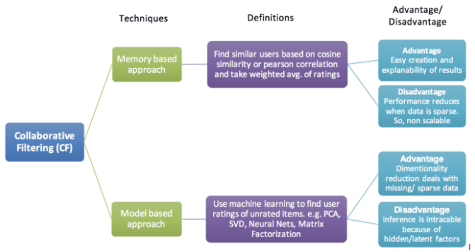

출처: https://kmhana.tistory.com/31

# 추천 알고리즘의 기본
> 1. 협업 필터링(Collaborative Filtering)
>> • Memory Based Approach
>>> - User-based Filtering
>>> - Item-based Filtering
>> • Model Based Approach
>>> - 행렬 분해(Matrix Factorization)
> 2. 콘텐츠 필터링(Contents-Based Filtering)

# 협업 필터링 이란 ?

#### 영화를 예시로 들때, 볼만한 영화를 어떻게 찾을까요?
> 1. 내가 좋아하는 감독, 장르, 키워드의 영화를 찾아본다
>> * Content Based Filtering
> 2. 나랑 성향이 비슷한 친구들이 본 영화를 찾아본다
>> * 협업 필터링(Collaborative Filetering)

# 협업 필터링(Collaborative Filtering) 특징
### 가정 : 나와 비슷한 취향의 사람들이 좋아하는 것은 나도 좋아할 가능성이 높다
> - 많은 사용자로 부터 얻은 취향 정보를 활용
* 핵심 포인트 : "많은 사용자들"로 부터 얻은 취향 정보를 활용
> - 사용자의 취향 정보 = 집단 지성 
> - 축적된 사용자들의 집단 지성을 기반으로 추천
> - 예: A 상품을 구매한 사용자가 A 상품 고객들이 함께 구매한 다른 상품들을 추천

# 협업 필터링 종류
* 협업 필터링(Collaborative Filtering) 대표 접근법 

> 1. Memory-Based Approach
>> - 유사한 사용자(Users)나 아이템(Item)을 사용
>> - 특징 : 최적화 방법이나, 매개변수를 학습하지 않음. 단순한 산술 연산만 사용
>> - 방법 : Cosine Similarity나 Pearson Correlation을 사용함, ( * KNN 방법도 포함됨)
>> - 장점 : 
>> - 1. 쉽게 만들 수 있음
>> - 2. 결과의 설명력이 좋음
>> - 3. 도메인에 의존적이지 않음
>> - 단점 : 
>> - 1. 데이터가 축적 X or Sparse한 경우 성능이 낮음
>> - 2. 확장가능성이 낮음 ( ∵ 데이터가 너무 많아지면, 속도가 저하됨)

> 2. Model-Based Approach
>> - 기계학습을 통해 추천
>> - 특징 : 최적화 방법이나, 매개변수를 학습
>> - 방법 : 행렬분해(Matrix Factorization), SVD, 신경망
>> - 장점 : 1. Sparse한 데이터도 처리 가능
>> - 단점 : 1. 결과의 설명력이 낮음