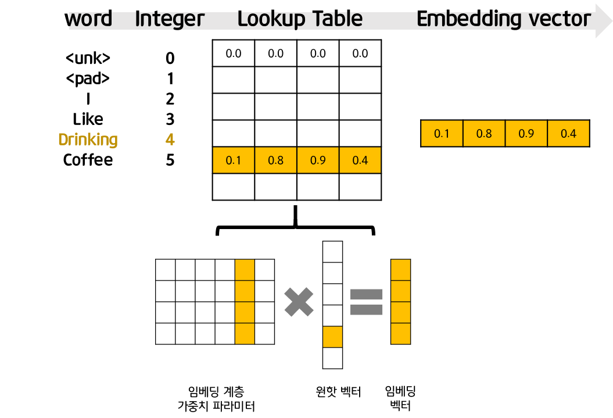

# 차원축소와 매니폴드 학습

---

출처: https://kh-kim.gitbook.io/natural-language-processing-with-pytorch/00-cover-5/02-dimension-reduction
출처: https://hazel01.tistory.com/30

---

# 차원 축소

---

높은 차원에서 데이터를 표현하는 과정에서 **희소성 문제**가 많이 나타난다. 또한 차원이 증가하면, 그걸 처리하기 위한 데이터량이 증가하는 차원의 저주 걸릴 수 도 있다. 따라서, 같은 정보를 표현할 때는 차원축소를 통해 더 낮은 차원으로 사용하는 것이 중요하다.

단어는 **모호성**을 가짐을 알 수 이었다. 이런 특징 때문에, 자연어 처리에서 단어나 문장, 문서를 **벡터로 나타내는 것은 중요**하다.
즉, 사람이 사용하는 자연어의 형태와 컴퓨터가 이해하는 벡터로 **변환이 가능한 함수 또는 맵핑 테이블을 만들어내는 과정이 중요**하다.

이번 장에서는 더 작은 차원으로 효율적으로 정보를 표현하는 **차원 축소**의 이유와 방법에 관해 다루어보겠습니다.

## 주성분 분석 ( Principal component analysis : PCA )

---

: 대표적인 차원 축소 방법으로, 주로 특잇값 분해 ( Singular value decomposition : SVD ) 를 통해 주성분을 분석할 수 있다. 즉, 데이터의 분포를 가장 잘 설명하는 성분을 찾아주는 것이다.

- 분석 변수들을 선형적으로 결합하여, **데이터를 가장 잘 표현할 수 있는 축**을 찾는 것이다! 그 축을 기준으로 차원을 축소해서 표현하는 것이 주성분 분석이다. ( 아래의 그림 참고 )

- 주성분은 데이터들의 분산이 가장 큼 방향 벡터를 말한다.

장점 : 고차원의 데이터를 더 낮은 차원으로 효과적으로 압축할 수 있다. 차원을 축소시켜 **연산 속도에 이점**을 가질 수 있다.

단점 : 실제 데이터(점)의 위치와 고차원 평면에 투사된 점의 거리가 생길 수 밖에 없다. 즉, **정보손실**이 발생할 수 있다. 특히 주성분은 직선 또는 평면이므로 정보손실은 불가피하다. -> 이렇게 많은 정보가 손실되면 효율적으로 학습하거나 복구할 수 없다. 특히, 데이터가 비선형적으로 구성될 수록 더욱 어려워진다.

- **PCA**를 수행할때, 아래의 가정을 가지고 데이터를 분석해야한다. ( 출처 : t-robotics.blogspot.com/ )

1. 데이터를 나타내는 submainfold는 직선의 basis를 가지고 있다.

   > : 만약, 직선의 데이터가 아니라면, 평평하게 펴주는 작업을 하던지, 커널등을 이용하여 비선형데이터도 잘 찾아주는 차원축소법을 사용해야한다. ( ex, kernel PCA , autoencoder )

2. 큰 분산을 갖는 방향이 중요한 정보를 가지고 있다고 가정한다.

   > : 만약, 분산이 큰 방향이 중요한 부분이 아니라면, 잘못된 방향으로 차원축소가 되버린다.

3. 우리가 찾은 주축(principal componenet)들은 서로 직교(orthogonal)한다고 생각해야한다.

---

## 매니폴드 가설 / 매니폴드 학습

---

: 높은 차원에 존재하는 데이터들의 경우, 해당 데이터들을 아우르는 **낮은 차원의 다양체(manifold)**가 존재한다는 가설이다.

출처 : https://excelsior-cjh.tistory.com/167

이처럼 3차원 공간에 분포한 데이터를 2차원으로 맵핑할 수 있다. 이를통해, 주성분 분석처럼 데이터를 고차원 평면에 선형적으로 투사하며 생긴 손실을 최소화 할 수 있다. 다차원을 2차원으로 변환시킴을 통해, decision boundary를 더 쉽게 찾을 수도 있고, 더 여러워 질수 있다. 따라서, 먼저 데이터셋이 어떤 모양을 하고있는냐를 살펴야한다.

- 특징

1.  3차원에서는 가까운 거리일지라도, 저차원공간에서 표현하면 더 멀어질 수 있다.
2.  저차원 공간상에서 가까운 점끼리는 실제로도 비슷한 특징을 가진다.

---

## 딥러닝으로 차원 축소를 한다는 것은!?

---

PCA처럼 선형적인 방식으로 차원을 축소하는 것에 비해, 딥러닝으로 차원 축소하는 것은 고차원상에서 매니폴드를 찾는 과정이다. 즉, 비선형적인 방식으로 차원 축소를 할 수 있다는 것이다. 즉, 해당 문제를 가장 잘 해결하기 위한 매니폴드를 자연스럽게 찾아낸다. 따라서, 딥러닝으로 차원축소하는 것이 잘 동작하는 이유가 될 수 있다. ( 아직 가설일 뿐이지만, 이 가설을 기반으로 성과를 내고 있다. )

---

## 오토인코더 ( Autoencoder )

---

: 오토인코더는 encoder 와 decoder로 구성되어있다.

: encoder는 **고차원의 샘플 벡터를 입력받아 매니폴드를 찾고, 저차원으로 축소하는 것**이다. 이후, 병목 구간(bottle-neck) 에서 숨겨진 벡터로 표현한다.

: decoder는 저차원의 벡터를 받아 원래 입력 샘플이 존재한던 **고차원으로 데이터를 복원하는 작업**을 수행한다.

- 오터 인코더 과정에서, 병목의 차원은 낮기 때문에, 복원에 필요한 정보만 남긴다. 이를 통해 정보손실이 발생하게 된다. 따라서, 모델을 훈련할 때는 복원된 데이터와 실제 데이터 사이의 차이를 최소화 하도록 손실함수를 구성하는 것이 중요하다. 그래도, 복원 데이터는 실제 입력과 차이가 있을 수 있다.

---

## Embedding layer : PyTorch 의 nn.Embedding()

---

- 임베딩 벡터를 사용하는 방법

1. 사전 훈련된( pre-training )된 임베딩 벡터 : word2vec과 같이 사전에 훈련한 모델을 사용한 벡터는 단어의 특징을 잘 반영하지만, 모델의 목적(종류)에 따라 최적의 벡터 임베딩이라고 생각하기는 힘들다. 즉, 목적 함수는 word2vec과 다른 형태로 존재한다. 따라서, 문제의 특징을 고려하지 않은 단어 임베딩 벡터는 훈련을 위해서 좋은 모델의 결과가 아니다.

2. 임베딩 층(embedding layer)을 만들어 훈련 데이터로부터 처음부터 임베딩 벡터를 학습하는 방법 : word2vec을 사용하여 임베딩 벡터로 변환하지 않아도, 단어 임베딩 벡터를 구할 수 있다. 사실, 파이토치 말고도 다른 딥러닝 프레임워크에는 embedding layer 레이어 아키텍처를 제공한다. 하지만, 여기서는 pytorch를 통해 공부를 할 예정이다.

---

# 임베딩 계층

---

- 임베딩 계층은 편차가 없는 선형 계층과 같은 형태를 지님. 즉, w = d x |V| 크기의 2차원 행렬임.

위의 그림처럼, 먼저 단어에 대한 정수값을 부여한 후, 그것을 단순히 테이블에서 검색(lookup)하는 작업을 수행한다. 하지만, 실제로 곱하는 것은 비효율적이므로, 원핫 인코딩 벡터의 1이 존재하는 단어의 인덱스 정수값만 있으면 된다는 것이다.

- 즉, lookup table이라는 것 (indexing)이 , one-hot vector 를 계산해주는 것과 결과가 동일하게 나온다.

 

---

## embedding layer 구현

---

- nn.Embedding 의 인자

num_embeddings : 임베딩을 할 단어들의 개수. 다시 말해 단어 집합의 크기입니다.
embedding_dim : 임베딩 할 벡터의 차원입니다. 사용자가 정해주는 하이퍼파라미터입니다.
padding_idx : 선택적으로 사용하는 인자입니다. 패딩을 위한 토큰의 인덱스를 알려줍니다.

```
# 임베딩 테이블 만들기
import torch.nn as nn
embedding_layer = nn.Embedding( num_embeddings= len(vocab),
                              embedding_dim= 3,
                              padding_idx= 1)

print(embedding_layer.weight)
```

# Parameter containing:

# tensor([[ 0.4461, -0.3181, 1.4489],

# [ 0.0000, 0.0000, 0.0000],

# [ 0.2904, 1.0054, 0.1691],

# [-0.4979, -0.4800, -0.5299],

# [-0.9313, 0.0596, -1.4454],

# [ 0.9046, -0.3420, 1.9003],

# [ 0.8238, -1.1525, 1.3341],

# [ 0.7268, -0.1303, -0.2054]], requires_grad=True)

---

# Word2vec

---

---

## 사전 훈련된 단어 임베딩을 고려할 상황도 존재함

---

1.  준비된 코퍼스의 양이 너무 적음

2.  외부로부터 많은 양의 말뭉치를 통해 미리 훈련한 단어 임베딩 벡터를 구하는 특수한 경우

3.  베이스 라인 모델을 만든 후, 성능을 끌어올리기 위한 방법으로 고려

4.  전이 학습 ( transfer learning )에서 살펴볼 고도화된 언어 모델을 통해 사전 훈련하여 접근 할 수 있음

---

## Word2Vec

---

: 단어를 벡터로 바꿔주는 알고리즘 . **Neural Network Language Model(NNLM)**을 계승하면서 학습속도와 성능을 비약적으로 끌어올렸다.

- 크게 **CBOW ( Continuous Bag of Word)**와 **skip-Gram** 방식이 있음.

  : 윈도우 크기가 주어지면, 특정 단어를 기준으로 윈도우 내의 주변 단어들을 사용하여 단어 임베딩을 학습함.

  - 단, 윈도우 내에서의 위치는 고려하지 않음

  - but, 단어의 위치를 무시하지는 않음. **윈도우 자체가 단어의 위치 정보를 내포**하기 때문.

: 단어가 바로 들어가는 것이 아니라, 단어를 인코딩 한 후, 임베딩하는 작업을 가짐.

    - 임베딩 계층에서 그려놓은 이미지와 동일

---

## Skip-gram 방식

---

- 학습 과정

: MLE(최대 가능도 추정)을 통해 다음 수식의 argmax 내의 수식을 최대로 하는 파라미터 θ를 찾음. 이를 통해 w가 주어졌을 때, 앞 뒤 n개의 단어를 예측하도록 훈련됨. 이때 윈도우 크기는 n이다.

: softmax 계층은 출력층임. 시그모이드 같은 비선형 함수가 존재하지 않음

6.4. Glove

: 대상단어에 대해서 코퍼스에 함께 나타난 단어별 출현 빈도를 예측하도록 함.

- 분류 문제가 아닌 출현 빈도를 근사하는 회귀 문제가 되었기 때문에 평균제곱 오차(MSE)를 사용함

: 원핫 인코딩 벡터 x 를 입력으로 받아 한개의 은닉층 W를 거쳐 출력층 W'을 통해 출력 벡터를 반환함. 이 출력 벡터는 단어 x와 함께 코퍼스에 출현했던 모든 단어의 각 동시 출현 빈도들을 나타낸 벡터인 C_x를 근사해야함. 이 둘의 차잇값인 손실을 최소화 하도록 역전파 및 경사하강법을 통해 학습할 수 있음.

- 이 때, 단어 x 자체의 출현 빈도 또는 사전확률에 따라 MSE손실 함수의 값의 크기가 매우 달라짐. C값이 클수록 손실 값은 커즘 따라서, f(x)는 단어의 빈도에 따라서 손실 함수의 가중치를 부여함

  6.4.1. 장점

1. 처음에 코퍼스를 통해 단어별 동시 출현 빈도를 조사하여 그에 대한 출현 빈도 행렬을 만들고, 이 후에 해당 행렬을 통해 동시 출혈 빈도를 근사하려함. 따라서, 코서프 전체를 훑으며 대상 단어와 주변단어를 가져와 학습하는 과정을 반복하는 skip-gram 보다 학습이 빠름

2. skip-gram은 사전확률이 낮은 ( 즉, 출현 빈도 자체가 적은) 단어에 대해서는 학습 기회가 적으나, glove는 어느정도 보안됨
