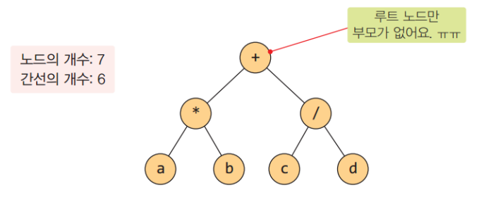
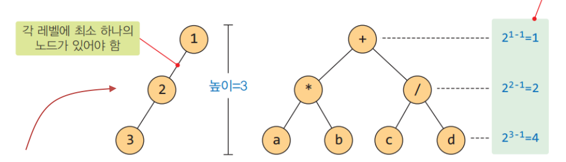
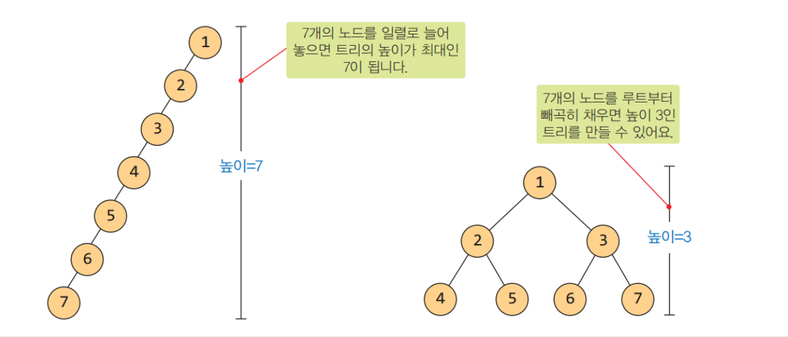
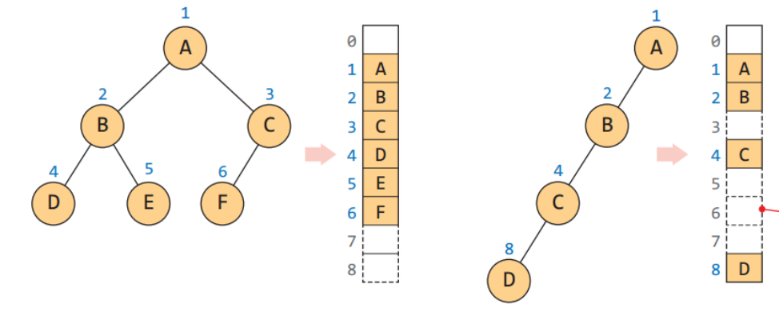
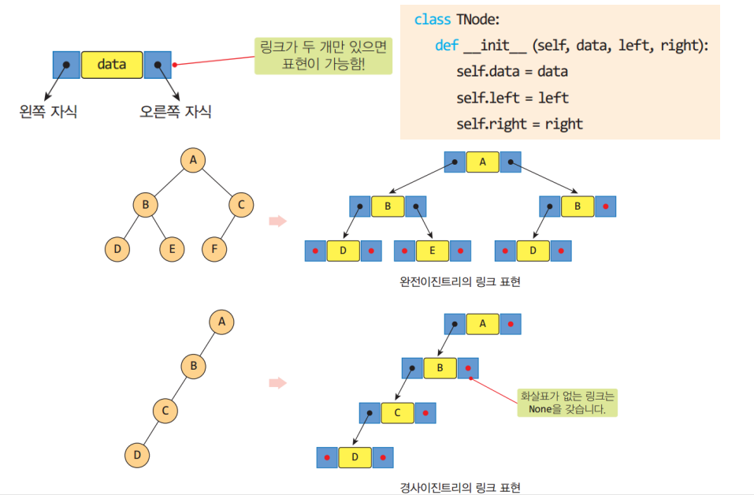
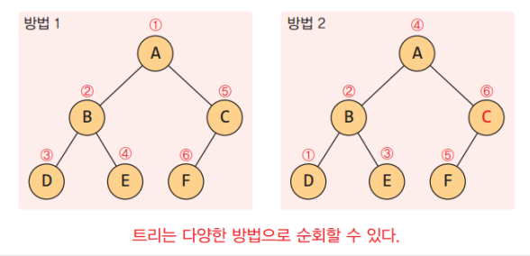

# 8장 트리

### 8장. 학습 목표

> * 트리의 개념과 용어들을 이해한다
> * 이진 트리의 표현 방법을 2가지 이해한다.
> * 이진트리의 순회방법들과 연산들을 이해한다.
> * 힙의 동작 원리와 효율성을 이해한다.
> * 배열 구조를 이용한 힙의 구현 방법을 이해한다.
> * 이진트리와 힙을 문제 해결에 활용할 수 있다.

## 8.1 트리란?

<u>트리는 계층적인 구조를 가지며</u>, **노드(Node)**와 **간선(Edge)**으로 구성된 **비선형 자료구조**입니다. 노드는 데이터를 저장하고 간선은 노드들을 연결합니다. <u>트리는 하나의 **루트(Root) 노드**에서 시작</u>하여 다양한 자식(Child) 노드들로 분기되는 구조를 가지며, 각 자식 노드는 부모(Parent) 노드에 의해 생성됩니다.

트리에서 사용되는 용어들은 다음과 같습니다:

- **루트(Root)**: 트리의 가장 상위에 있는 노드로, 다른 모든 노드들은 루트 노드의 자식이거나 자손입니다.
- **부모(Parent)**: 어떤 노드의 바로 위에 있는 노드를 부모 노드라고 합니다.
- **자식(Child)**: 어떤 노드의 바로 아래에 있는 노드를 자식 노드라고 합니다.
- **형제(Sibling)**: 같은 부모를 가지고 있는 노드들을 형제 노드라고 합니다.
- **조상(Ancestor)**: 어떤 노드의 <u>위에 있는 모든 노드</u>들을 그 노드의 조상 노드라고 합니다.
- **자손(Descendant)**: 어떤 노드 <u>아래에 있는 모든 노드</u>들을 그 노드의 자손 노드라고 합니다.
- **차수(Degree)**: 어떤 노드의 <u>자식 노드의 수</u>를 차수라고 합니다.
- **잎 노드(Leaf Node)**: <u>자식이 없는 노드</u>를 잎 노드 또는 단말 노드라고 합니다.
- **서브트리(Subtree)**: 트리 내에서 <u>특정 노드와 그 자손 노드들로 구성된 부분 트리</u>를 서브트리라고 합니다.

트리는 계층적인 관계를 표현하기에 용이하며, 다양한 응용 분야에서 사용됩니다. 예를 들어, <u>파일 시스템의 디렉토리 구조, 조직도, 계층적인 데이터 구조</u> 등에서 트리 구조가 적용될 수 있습니다.

## 8.2 이진 트리

> * 이진 트리는 순환적으로 정의된다.
> * 이진트리의 종류와 성질
> * 이진트리의 표현 방법

**이진 트리(Binary Tree)**는 <u>각 노드가 최대 두 개의 자식을 가질 수 있는 트리</u>입니다. 이진 트리는 부모 노드와 최대 두 개의 자식 노드로 구성되며, 왼쪽 자식과 오른쪽 자식 노드를 구분합니다. 각 노드는 하나의 데이터를 저장하며, 자식 노드가 없을 경우 잎 노드(리프 노드)가 됩니다.

이진 트리는 여러 가지 표현 방법이 있습니다. 그 중에서도 가장 일반적인 방법은 포화 이진 트리와 완전 이진 트리입니다.

1. **포화 이진 트리(Full Binary Tree)**:
   - 모든 레벨에서 <u>노드들이 꽉 찬 상태인 이진 트리</u>입니다.
   - 즉, <u>모든 내부 노드가 두 개의 자식을 가지고 있고, 잎 노드를 제외한 모든 노드의 차수가 2인 트리</u>입니다.
   - 레벨당 최대 노드 수는 2^k개로, 전체 노드 수는 2^(k+1) - 1개입니다.
2. **완전 이진 트리(Complete Binary Tree)**:
   - 레벨이 k인 완전 이진 트리는 <u>레벨 k-1까지는 포화 이진 트리</u>이고, 마지막 레벨은 왼쪽부터 오른쪽으로 노드들이 순서대로 채워진 트리입니다.
   - 모든 레벨에서 노드들은 왼쪽부터 채워지며, 마지막 레벨에서 오른쪽에 빈 자리가 있을 수 있습니다.
   - 레벨별로 왼쪽에서 오른쪽으로 순서대로 노드가 추가되기 때문에 배열이나 리스트로 효율적으로 표현될 수 있습니다.

포화 이진 트리와 완전 이진 트리는 트리의 형태와 노드의 배치에 따라 다르게 구성됩니다. 이러한 특징을 이용하여 트리를 저장하고 효율적으로 탐색하거나 연산을 수행할 수 있습니다.

### 이진 트리의 성질

* 노드의 개수가 n개이면 간선의 개수는 n-1

* 높이가 h 이면 h ~ 2^h - 1 개의 노드를 가짐

* n개의 노드를 가지는 이진 트리 높이: [log2(n+1)] ~ n

> n개의 노드를 가지는 높이 h의 이진 트리가 가질 수 있는 노드 개수의 최댓값: 2^h-1, n <= 2^h - 1, h >= log2(n+1), h는 정수

이진 트리를 표현하는 방법은 주로 **배열 표현법(Array Representation)**과 **링크 표현법(Link Representation)** 두 가지가 있습니다.

1. **배열 표현법 (Array Representation)**:

   - 이진 트리의 노드를 <u>배열에 저장하는 방법</u>입니다.
   - <u>배열을 사용하여 트리의 각 노드를 인덱스로 표현</u>합니다.
   - 일반적으로 <u>완전 이진 트리의 경우에 사용</u>됩니다.
   - 각 노드의 자식 노드는 배열에서 특정한 위치에 저장됩니다.
   - 부모와 자식 간의 관계를 <u>인덱스로 계산하여 효율적인 접근이 가능</u>합니다.
   - 트리의 크기에 따라 배열의 크기가 정해지므로 메모리 공간 활용이 중요합니다.
   - 하지만 <u>트리의 구조가 동적으로 변경되는 경우 배열의 크기를 조정해야 하는 단점</u>이 있습니다.

   

2. **링크 표현법 (Link Representation)**:

   - 이진 트리의 <u>각 노드를 독립적인 객체로 표현</u>하고, <u>객체들 간의 링크(포인터)를 통해 관계를 표현하는 방법</u>입니다.
   - <u>객체 지향 프로그래밍에서 자주 사용</u>됩니다.
   - 각 노드는 <u>자신의 데이터와 왼쪽 자식 노드와 오른쪽 자식 노드를 가리키는 링크(포인터)를 가지고 있습니다.</u>
   - <u>트리의 구조를 동적으로 변경</u>할 수 있으며, <u>메모리 공간을 효율적으로 활용</u>할 수 있습니다.
   - 하지만 <u>포인터를 사용하기 때문에 추가적인 메모리 공간이 필요</u>하고, 포인터 연산에 대한 <u>오버헤드가 발생</u>할 수 있습니다.

   

이진 트리의 표현 방법은 특정한 상황이나 문제에 따라 선택되어야 합니다. **배열 표현법**은 <u>트리의 구조가 정적이고 완전 이진 트리인 경우에 유용</u>하며, **링크 표현법**은 <u>동적인 구조를 필요로 하는 경우나 트리의 크기가 변하는 경우에 유용</u>합니다. 선택할 표현 방법은 메모리 사용, 접근 시간, 구현의 용이성 등을 고려하여 결정해야 합니다.

## 8.3 이진트리의 연산

순회(traversal): 

* 트리에 속하는 모든 노드를 한 번씩 방문하는 것
* 트리에서 가장 기본적인 연산
* 선형 자료구조는 순회가 단순
* 트리는 다양한 방법이 있음

이진 트리의 순회 방법은 전위 순회(preorder traversal), 중위 순회(inorder traversal), 후위 순회(postorder traversal) 세 가지가 있습니다. 각각의 순회 방법은 트리의 노드를 어떤 순서로 방문하는지를 나타냅니다.

1. 전위 순회 (Preorder Traversal):
   - 노드를 다음 순서로 방문합니다: 루트 노드 -> 왼쪽 서브트리 -> 오른쪽 서브트리
   - 주로 노드의 값을 출력하는 용도로 사용됩니다.
   - 루트를 가장 먼저 방문하고, 그 다음에 왼쪽 서브트리를 순회한 후 오른쪽 서브트리를 순회합니다.
2. 중위 순회 (Inorder Traversal):
   - 노드를 다음 순서로 방문합니다: 왼쪽 서브트리 -> 루트 노드 -> 오른쪽 서브트리
   - 이진 탐색 트리에서 정렬된 값을 출력하기 위해 주로 사용됩니다.
   - 왼쪽 서브트리를 순회한 후 루트를 방문하고, 마지막으로 오른쪽 서브트리를 순회합니다.
3. 후위 순회 (Postorder Traversal):
   - 노드를 다음 순서로 방문합니다: 왼쪽 서브트리 -> 오른쪽 서브트리 -> 루트 노드
   - 주로 트리의 구조를 해체하거나 메모리를 해제하는 용도로 사용됩니다.
   - 왼쪽 서브트리와 오른쪽 서브트리를 순회한 후에 마지막으로 루트를 방문합니다.

이진 트리의 순회를 수행하는 연산에는 순회 연산 이외에도 다음과 같은 연산들이 있습니다:

- 탐색 (Search): 특정한 값을 가진 노드를 찾는 연산입니다. 일반적으로 이진 탐색 트리에서 사용됩니다.
- 삽입 (Insertion): 새로운 노드를 트리에 삽입하는 연산입니다. 이진 탐색 트리에서는 삽입 위치를 찾은 후 새로운 노드를 추가합니다.
- 삭제 (Deletion): 트리에서 특정한 값을 가진 노드를 삭제하는 연산입니다. 삭제 후에 트리의 구조를 유지해야 합니다.
- 높이 계산 (Height Calculation): 트리의 높이를 계산하는 연산으로, 루트 노드부터 가장 깊은 단말 노드까지의 경로
